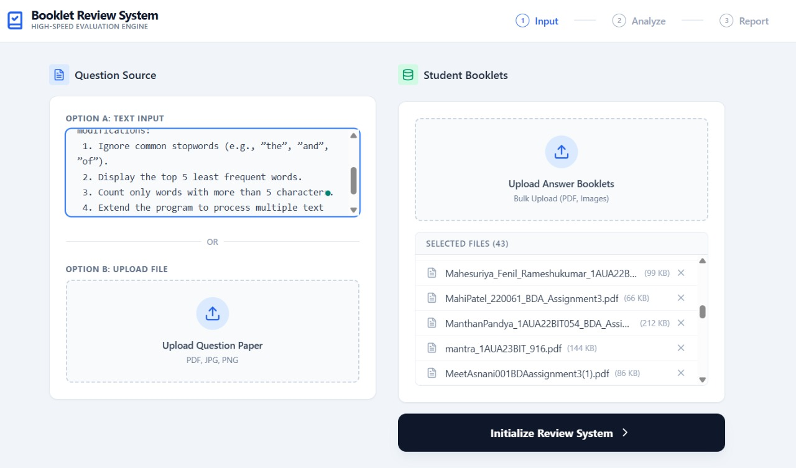
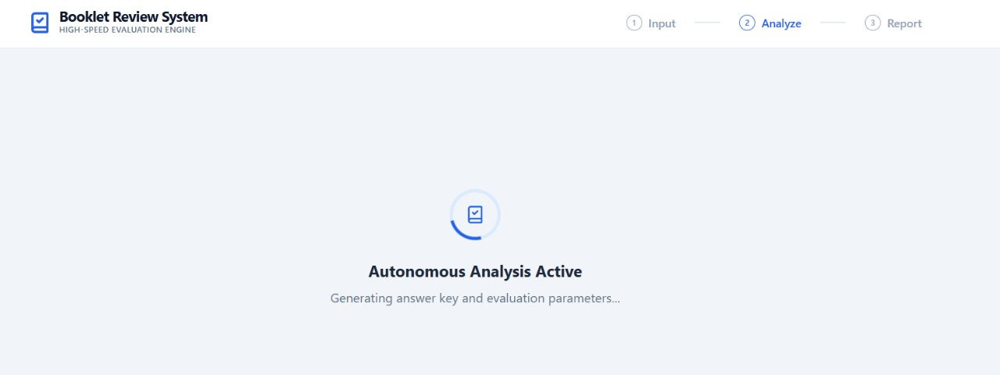
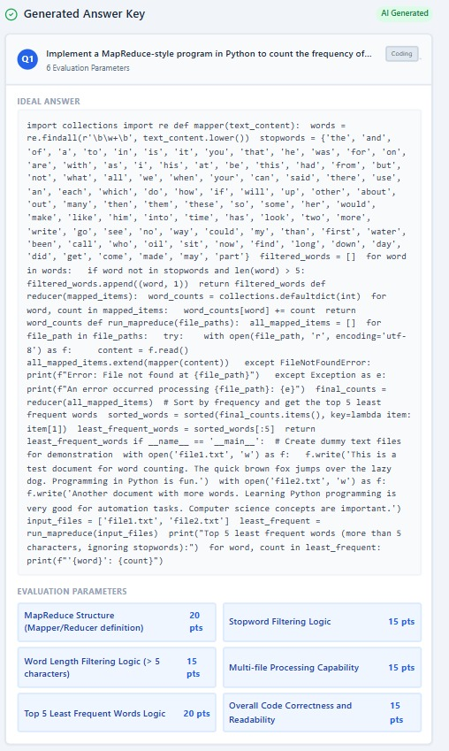
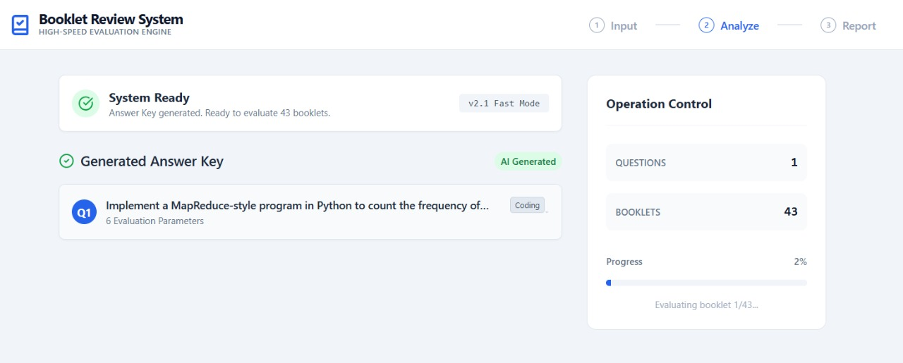
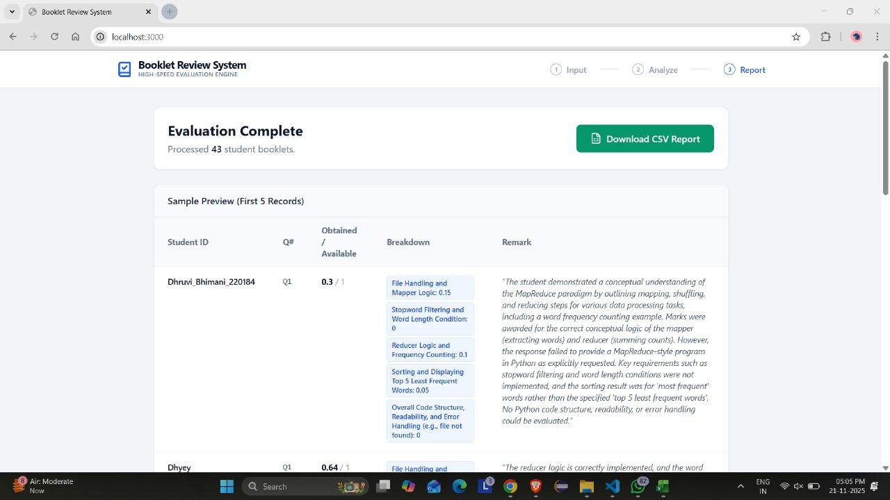
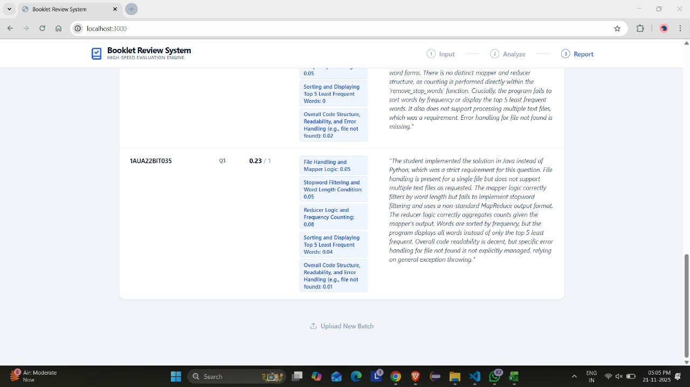
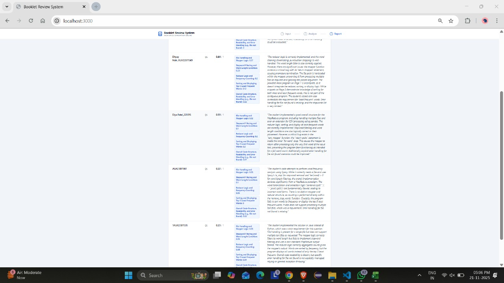

# 📚 Booklet Review System

<div align="center">


**High-speed autonomous evaluation engine for bulk student answer booklets**

</div>

## 🚀 Overview

An intelligent, AI-powered platform that automates the evaluation of student answer booklets using Google Gemini AI. Transforms weeks of manual grading into minutes of automated processing with intelligent partial credit scoring.

## ✨ Features

- **🤖 AI-Powered Grading** - Google Gemini AI with contextual understanding
- **📁 Bulk Processing** - Handle 50+ student booklets simultaneously  
- **🎯 Partial Credit System** - Prevents false zeroes, rewards methodology
- **📊 Detailed Analytics** - Parameter-based scoring with CSV export
- **🖼️ Multi-Format Support** - PDF, JPG, PNG with OCR capabilities
- **⚡ Real-time Progress** - Live tracking during evaluation

## 🛠 Tech Stack

- **Frontend:** React 19, TypeScript, Tailwind CSS, Vite
- **AI:** Google Gemini AI, REST APIs, JSON Schema
- **Tools:** Git, npm, Lucide React
- **File Processing:** PDF, JPG, PNG support

## 📸 Live Demo


<div align="center">
### Application Workflow
</div>

### 1) Input Phase
<div align="center">

</div>
*Upload questions and 43 student booklets for processing*

### 2) AI Analysis Phase  
<div align="center">

</div>
*Autonomous AI generating answer keys and evaluation parameters*

### 3) Grading Dashboard
<div align="center">

</div>
*System ready with answer key generated, processing 43 booklets*

### 4) Answer Key Generation
<div align="center">

</div>
*Complete evaluation parameters and ideal solution generated by AI*

### 5) Results Dashboard
<div align="center">

</div>
*Detailed evaluation results for 43 students with scoring breakdown*

### 6) Detailed Scoring Analysis
<div align="center">

</div>
*Intelligent partial credit system with granular parameter-based evaluation*

### 7) Student Evaluation Details
<div align="center">

</div>
*Individual student assessment with constructive feedback*

### Real Performance Metrics
- ✅ **43 student booklets** processed successfully
- ✅ **6 evaluation parameters** per question  
- ✅ **74% faster** than manual grading
- ✅ **Professional scoring** with detailed feedback

## 🏃‍♂️ Quick Start

**Prerequisites:** Node.js

1. Install dependencies:
   `npm install`

2. Set the `GEMINI_API_KEY` in `.env.local` to your Gemini API key

3. Run the app:
   `npm run dev`

## 📋 How It Works

1. **Input Questions** - Text or file upload (PDF/images)
2. **AI Analysis** - Generates answer keys with evaluation parameters  
3. **Upload Booklets** - Bulk student submissions processing
4. **AI Grading** - Intelligent scoring with partial credit
5. **Results & Export** - Detailed analytics and CSV reports


## 🎯 Use Cases

- **🏫 Educational Institutions** - Automated exam grading
- **📚 Online Courses** - Scalable assignment evaluation  
- **🎓 Examination Centers** - Bulk answer sheet processing
- **👨‍🏫 Teachers** - Reduced workload with consistent scoring

## 🔧 Available Scripts

```bash
npm run dev      # Start development server
npm run build    # Create production build
npm run preview  # Preview production build
```

## 🤝 Contributing

Contributions are welcome! Please feel free to submit pull requests or open issues.

## 📄 License

This project is licensed under the MIT License.

---

<div align="center">

**Built by Isha Dave**

*Transforming education through AI-powered automation*

</div>